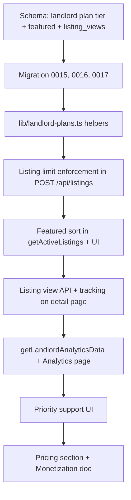

# Landlord Features Implementation and Competitive Free Plan

## Competitor Research Summary


| Platform               | Free Offer                                                                            | Paid                                           |
| ---------------------- | ------------------------------------------------------------------------------------- | ---------------------------------------------- |
| **ikman.lk**           | 2 property ads/month, 2 short-term rental ads/month; rentals under LKR 10k/month free | Membership for more ads; Boost Ad from LKR 150 |
| **Lanka Property Web** | Fully free for sale, rent, land listings                                              | N/A (ad-supported)                             |


Easy Rent's differentiator: rental-focused, verified landlords, Sri Lanka-specific features (power backup, water, fiber). To compete: offer a generous FREE tier that attracts landlords, then upsell Premium/Subscription.

---

## Part 1: Attractive FREE Landlord Plan

### Proposed Landlord Plan Structure


| Plan             | Price                 | Listings                              | Features                                                              |
| ---------------- | --------------------- | ------------------------------------- | --------------------------------------------------------------------- |
| **Free**         | LKR 0                 | 2 active listings (renewable monthly) | List on Easy Rent, direct contact, phone/WhatsApp, basic visibility |
| **Basic**        | LKR 500/listing/month | 1 paid listing (or top-up)            | Same as Free + priority in search                                     |
| **Premium**      | LKR 1,000–1,500/month | 5 listings included                   | Featured placement, analytics dashboard                               |
| **Subscription** | LKR 2,000/month       | Unlimited                             | All Premium + priority support                                        |


**Free plan rationale:** More generous than ikman (2/month, no expiry complexity) and aligned with Lanka Property Web's free ethos. "2 active listings" = landlord can have 2 live listings at once; when one is rented/archived, they can post another. Monthly refresh optional (e.g. 2 new listings per month) to match ikman—simplest: **2 concurrent active listings per landlord**.

---

## Part 2: Schema and Backend Changes

### 2.1 Landlord Plan Tier

**File:** [lib/db/schema.ts](lib/db/schema.ts)

Add to `landlords` table:

```ts
landlordPlanTier: varchar('landlord_plan_tier', { length: 20 }).default('free'), // free | basic | premium | subscription
landlordPlanExpiresAt: timestamp('landlord_plan_expires_at'),
```

**Migration:** New migration `0015_landlord_plan_tier.sql`

### 2.2 Featured Listings

**File:** [lib/db/schema.ts](lib/db/schema.ts)

Add to `listings` table:

```ts
featured: boolean('featured').notNull().default(false), // Premium/Subscription landlords
featuredAt: timestamp('featured_at'),
```

**Migration:** New migration `0016_listing_featured.sql`

**Logic:** When `landlordPlanTier` is `premium` or `subscription`, landlord can mark listings as featured (or auto-featured for all their listings). Ops can also set `featured` for verified/visited.

### 2.3 Listing View Tracking (for Analytics)

**File:** [lib/db/schema.ts](lib/db/schema.ts)

New table `listing_views`:

```ts
listingViews = pgTable('listing_views', {
  id: serial('id').primaryKey(),
  listingId: integer('listing_id').notNull().references(() => listings.id),
  viewedAt: timestamp('viewed_at').notNull().defaultNow(),
  // Optional: sessionId or userId for dedup (anon views = session)
});
```

**Migration:** New migration `0017_listing_views.sql`

**Tracking:** Increment on listing detail page view (server action or API). For MVP, count all views; later add session dedup.

### 2.4 Listing Limits Enforcement

**File:** [app/api/listings/route.ts](app/api/listings/route.ts)

Before creating a listing:

1. Resolve landlord's `landlordPlanTier` (from `landlords` table).
2. Count active listings for this landlord: `status = 'active'` and `expiresAt > now` (or not expired).
3. Enforce limits:
  - `free`: max 2 active
  - `basic`: max 1 paid (or treat as +1 on top of free—simplify: basic = 1 listing, paid)
  - `premium`: max 5
  - `subscription`: unlimited

**New helper:** `lib/landlord-plans.ts` – `getLandlordPlanTier(landlord)`, `getListingLimit(tier)`, `canCreateListing(landlordId)`.

### 2.5 Featured Placement in Queries

**File:** [lib/db/queries.ts](lib/db/queries.ts)

- Add `sortFeaturedFirst?: boolean` to `getActiveListings` filters.
- When true, order by `featured DESC, createdAt DESC` (or similar).
- Update [components/featured-listings.tsx](components/featured-listings.tsx): prefer `featured` listings, fallback to `verified || visited`.
- Update [app/(dashboard)/listings/page.tsx](app/(dashboard)/listings/page.tsx), [app/api/listings/paginated/route.ts](app/api/listings/paginated/route.ts): pass `sortFeaturedFirst: true` so featured listings appear first in search.

### 2.6 Landlord Analytics Dashboard

**New file:** `lib/db/queries.ts` – add `getLandlordAnalyticsData(landlordId)`:

- Total listings (active, rented, etc.)
- Views per listing (from `listing_views`)
- Top-performing listings by views
- Listings expiring soon

**New page:** [app/(dashboard)/dashboard/analytics/page.tsx](app/(dashboard)/dashboard/analytics/page.tsx)

- Server component, fetch `getLandlordAnalyticsData` for current user's landlord.
- Show: listing counts, views chart (simple), expiring soon.
- **Access control:** Only for landlords with `premium` or `subscription` tier. Free/Basic see upgrade CTA.

**Dashboard nav:** Add "Analytics" link in [app/(dashboard)/dashboard/layout.tsx](app/(dashboard)/dashboard/layout.tsx) – show only for Premium/Subscription landlords.

### 2.7 Listing View Tracking Implementation

**File:** [app/(dashboard)/listings/[id]/page.tsx](app/(dashboard)/listings/[id]/page.tsx) or [app/listings/[id]/page.tsx](app/listings/[id]/page.tsx)

- On listing detail load, call API `POST /api/listings/[id]/view` to record a view.
- API: insert into `listing_views`, rate-limit by IP/session to avoid spam.

**New API:** [app/api/listings/[id]/view/route.ts](app/api/listings/[id]/view/route.ts)

### 2.8 Priority Support

**Implementation:** Lightweight – no full ticketing system.

- Add "Contact Support" in dashboard for Subscription landlords with "Priority" badge.
- Link to email `support@easyrent.lk` or a Typeform with `?plan=subscription` for routing.
- **UI:** [app/(dashboard)/dashboard/layout.tsx](app/(dashboard)/dashboard/layout.tsx) or a Support link in footer/settings – show "Priority Support" for Subscription tier.

---

## Part 3: Pricing Section and Monetization Doc Updates

### 3.1 Add Free Plan to Landlord Pricing

**File:** [components/pricing-section.tsx](components/pricing-section.tsx)

Restructure `LANDLORD_PLANS`:

```ts
const LANDLORD_PLANS = [
  {
    name: 'Free',
    price: 'LKR 0',
    period: 'forever',
    features: ['Up to 2 active listings', 'Direct contact', 'Phone & WhatsApp on listing', 'List on Easy Rent'],
    icon: Building2,
  },
  {
    name: 'Basic',
    price: 'LKR 500',
    period: '/listing/month',
    features: ['1 paid listing', 'Priority in search', 'Direct contact', 'Phone & WhatsApp'],
    icon: Building2,
  },
  // ... Premium, Subscription
];
```

### 3.2 Monetization Plan

**File:** [Monetization Plan & Strategy.md](Monetization Plan & Strategy.md)

- Add Free plan section for landlords.
- Update Basic/Premium/Subscription to match implementation.
- Add competitor comparison (ikman, Lanka Property Web) and Easy Rent differentiators.

### 3.3 For-Landlords Section

**File:** [components/for-landlords-section.tsx](components/for-landlords-section.tsx)

- Update copy: "Start free with 2 listings" or similar.

---

## Part 4: Implementation Order




---

## Files to Create/Modify


| File                                                                       | Action                                                          |
| -------------------------------------------------------------------------- | --------------------------------------------------------------- |
| `lib/db/migrations/0015_landlord_plan_tier.sql`                            | Create                                                          |
| `lib/db/migrations/0016_listing_featured.sql`                              | Create                                                          |
| `lib/db/migrations/0017_listing_views.sql`                                 | Create                                                          |
| `lib/db/schema.ts`                                                         | Add landlordPlanTier, featured, listingViews                    |
| `lib/landlord-plans.ts`                                                    | Create (getLandlordPlanTier, getListingLimit, canCreateListing) |
| `app/api/listings/route.ts`                                                | Enforce listing limits before create                            |
| `lib/db/queries.ts`                                                        | Add sortFeaturedFirst, getLandlordAnalyticsData                 |
| `app/api/listings/[id]/view/route.ts`                                      | Create (record view)                                            |
| `app/(dashboard)/listings/[id]/page.tsx` or `app/listings/[id]/page.tsx`   | Call view API on load                                           |
| `app/(dashboard)/dashboard/analytics/page.tsx`                             | Create                                                          |
| `app/(dashboard)/dashboard/layout.tsx`                                     | Add Analytics nav, conditional on tier                          |
| `components/pricing-section.tsx`                                           | Add Free plan, update copy                                      |
| `components/featured-listings.tsx`                                         | Use featured + sortFeaturedFirst                                |
| `app/(dashboard)/listings/page.tsx`, `app/api/listings/paginated/route.ts` | Pass sortFeaturedFirst                                          |
| `Monetization Plan & Strategy.md`                                          | Update with Free plan, competitor notes                         |
| `components/for-landlords-section.tsx`                                     | Update copy                                                     |
| Support link (dashboard or settings)                                       | Add "Priority Support" for Subscription                         |


---

## Verification

- Free landlord: can create up to 2 active listings; blocked on 3rd.
- Premium/Subscription: can set listings as featured; featured appear first in search.
- Analytics page: visible to Premium/Subscription; shows views and listing stats.
- Priority support: Subscription landlords see dedicated support link.
- Pricing section: shows Free plan; copy matches implementation.

